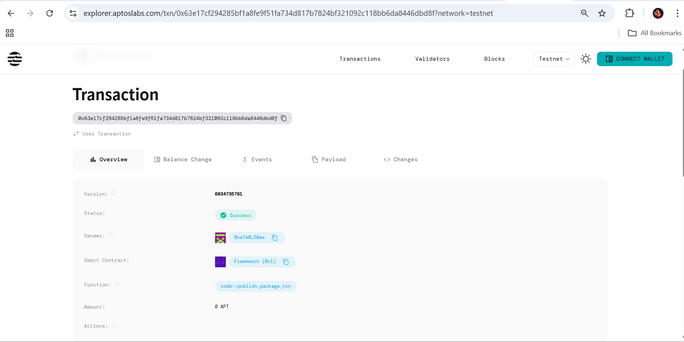
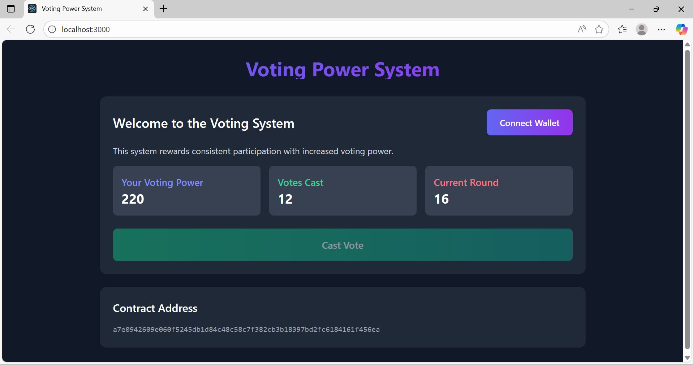
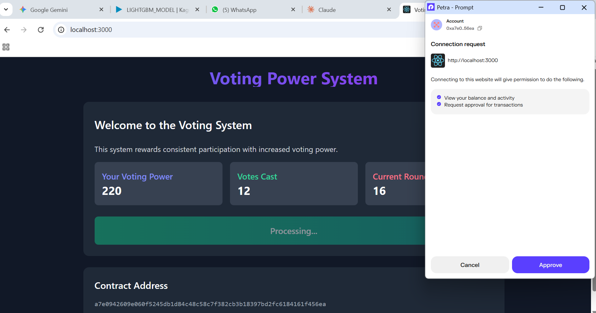
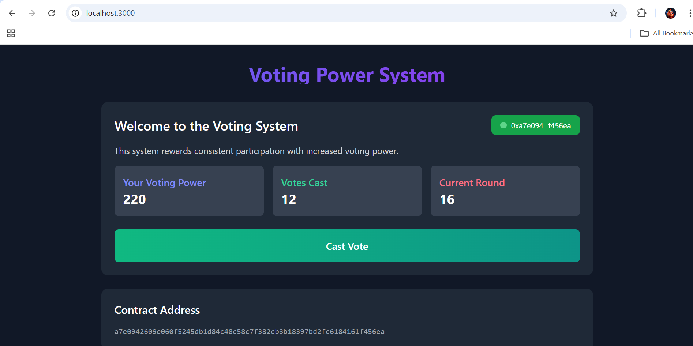

# Voting Power Based on Historical Participation

## Project Description

This smart contract implements a dynamic voting system where users' voting power increases based on their historical participation in governance activities. The more a user participates in voting rounds, the more voting power they accumulate for future decisions. This incentivizes consistent engagement and rewards long-term community members with greater influence in governance matters.

## Project Vision

Our vision is to create a more equitable and engagement-driven governance system that:
- Rewards consistent participation over one-time large stakeholder influence
- Encourages long-term community building and engagement
- Creates a meritocratic voting system based on historical contribution
- Promotes democratic participation while giving experienced voters more influence

The system aims to balance democratic principles with the wisdom of experienced community members, creating a sustainable governance model that grows stronger over time.

## Key Features

### Core Functionality
- **Historical Participation Tracking**: Records every vote cast by each participant
- **Dynamic Voting Power Calculation**: Automatically calculates voting power based on participation history
- **Progressive Reward System**: More participation equals greater voting influence
- **Round-based Voting**: Organized voting rounds with systematic tracking

### Technical Features
- **Automatic Registration**: New voters are automatically registered on first vote
- **Scalable Architecture**: Efficient storage and calculation of participation metrics
- **Transparent Scoring**: Clear algorithm for calculating voting power
- **Secure Implementation**: Built on Aptos framework with proper access controls

### User Benefits
- **Merit-based Influence**: Voting power earned through consistent participation
- **Community Building**: Incentivizes long-term engagement
- **Fair Representation**: Prevents manipulation by large one-time stakeholders
- **Growth Rewards**: Voting power increases with continued participation

## Future Scope

### Short-term Enhancements
- **Decay Mechanism**: Implement time-based decay for inactive voters
- **Category-specific Voting**: Different voting power for different proposal types
- **Delegation System**: Allow voters to delegate their earned voting power
- **Participation Streaks**: Bonus multipliers for consecutive voting rounds

### Medium-term Features
- **Advanced Metrics**: Include proposal creation and discussion participation
- **Governance Tokens**: Integration with token-based governance systems
- **Multi-chain Support**: Expand to other blockchain networks
- **Analytics Dashboard**: Real-time participation and voting power statistics

### Long-term Vision
- **AI-powered Governance**: Smart recommendation systems for voters
- **Cross-platform Integration**: Connect with external governance platforms
- **Reputation System**: Broader reputation metrics beyond just voting
- **Quadratic Voting**: Implement quadratic voting with participation weighting

### Research and Development
- **Game Theory Analysis**: Optimize incentive mechanisms
- **Sybil Resistance**: Advanced mechanisms to prevent fake accounts
- **Privacy Features**: Zero-knowledge proofs for private voting
- **Interoperability**: Cross-chain governance participation tracking

## Contract Details

0x63e17cf294285bf1a8fe9f51fa734d817b7824bf321092c118bb6da8446dbd8f




## Full Stack App

Built using React.js, Tailwind CSS, and Petra Wallet integration for seamless blockchain interaction.

### Frontend Features
- **Modern React Interface**: Clean, responsive UI built with React 18
- **Tailwind CSS Styling**: Beautiful gradient designs and glass morphism effects
- **Petra Wallet Integration**: Direct connection to Aptos blockchain
- **Real-time Updates**: Live voting power and participation tracking
- **Interactive Voting**: Simple click-to-vote interface

### Tech Stack
- **Frontend**: React.js, Tailwind CSS
- **Blockchain**: Aptos Move smart contracts
- **Wallet**: Petra Wallet extension
- **Network**: Aptos Testnet

## Setup Instructions

### Prerequisites
1. **Install Petra Wallet**
   - Go to [Petra Wallet](https://petra.app/) and install the browser extension
   - Create a new wallet or import existing one
   - Switch to **Testnet** network
   - Get testnet APT from the [Aptos Faucet](https://aptoslabs.com/testnet-faucet)

### Running the Application

1. **Navigate to frontend directory**:
   ```bash
   cd voting-frontend
   ```

2. **Install dependencies**:
   ```bash
   npm install
   ```

3. **Start the development server**:
   ```bash
   npm start
   ```

4. **Open your browser** and go to `http://localhost:3000`

### Using the App

1. **Connect Wallet**: Click "Connect Wallet" button to link your Petra wallet
2. **View Stats**: See your current voting power and participation history
3. **Cast Votes**: Click "Cast Vote" to participate and increase your voting power
4. **Track Progress**: Watch your voting power grow with each participation

### Contract Integration

- **Contract Address**: `a7e0942609e060f5245db1d84c48c58c7f382cb3b18397bd2fc6184161f456ea`
- **Functions Used**:
  - `initialize_voting_system`: Sets up the voting system
  - `cast_vote`: Records user participation and updates voting power

### Home Interface



The interface shows:
- **Voting Power**: Your current influence level (starts at 100, grows by 10 per vote)
- **Votes Cast**: Total number of votes you've participated in
- **Current Round**: The active voting round number
- **Connect Wallet**: Button to link your Petra wallet




- **Cast Vote**: Button to participate in voting (increases your power)



### Voting Power Algorithm

```
Voting Power = Base Power (100) + (Participation Score × Multiplier (10))
```

Example: After 5 votes → 100 + (5 × 10) = 150 voting power


